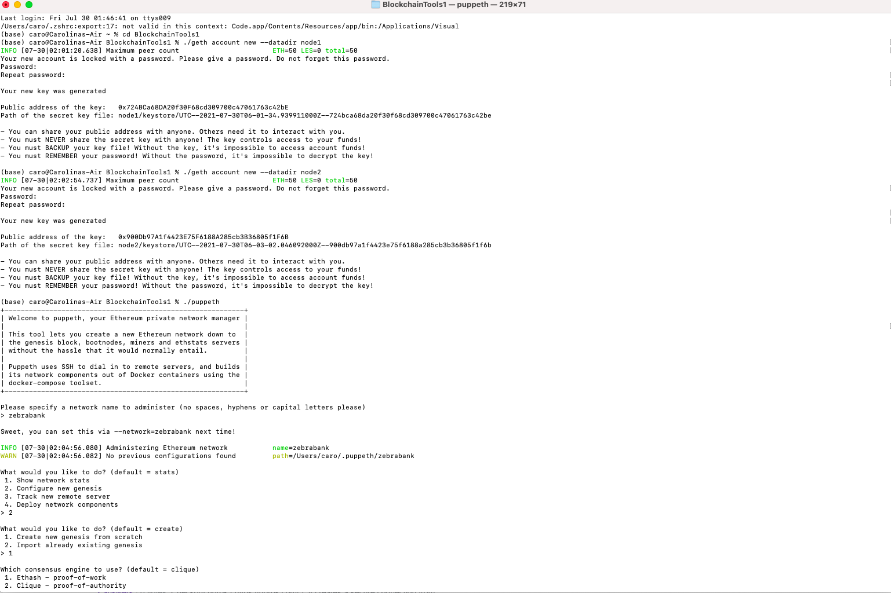
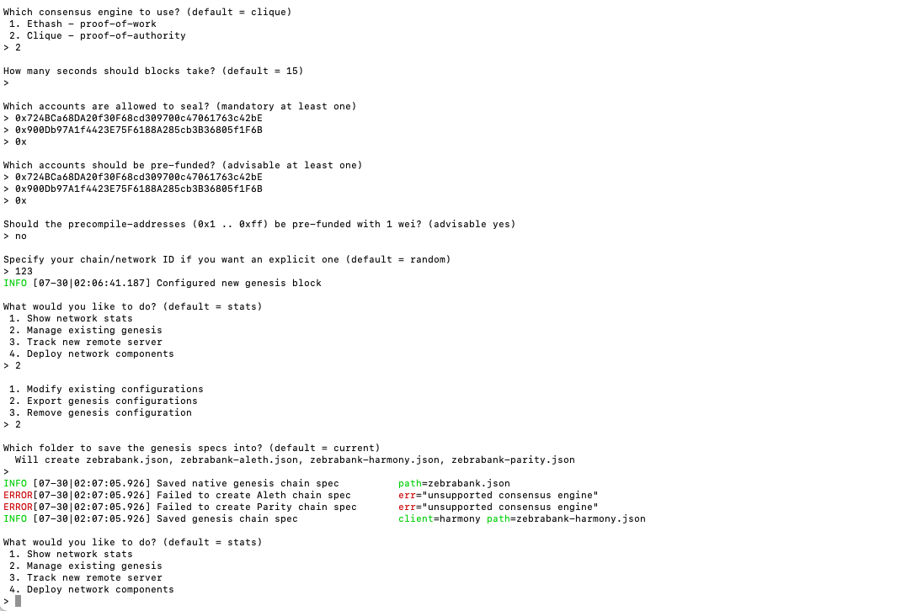
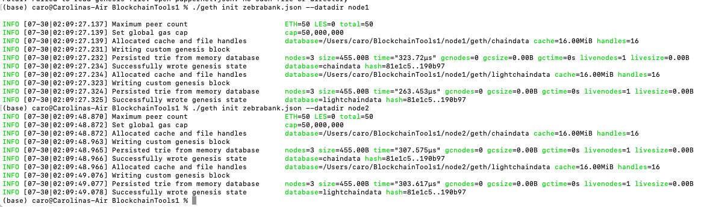
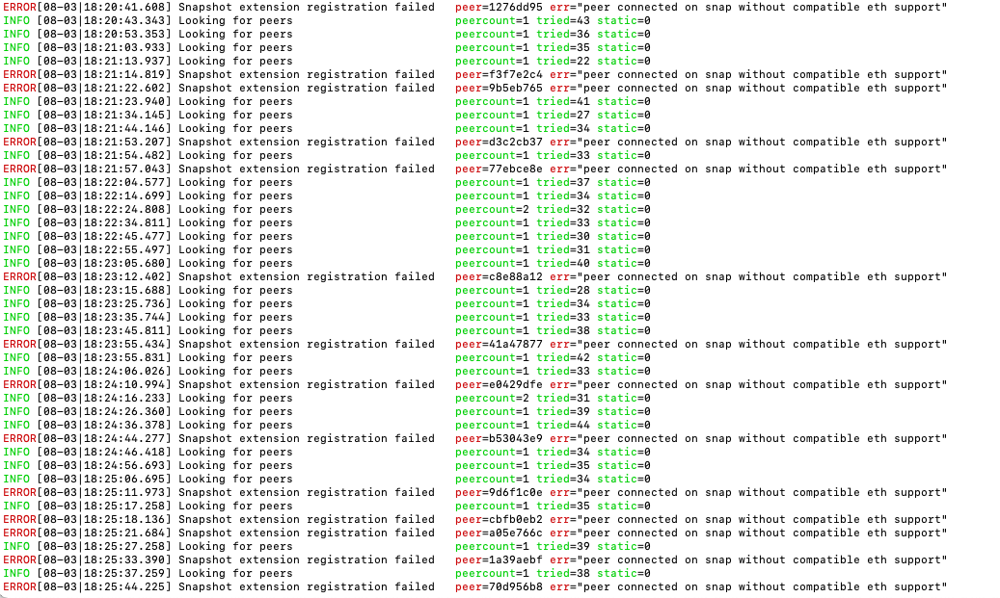
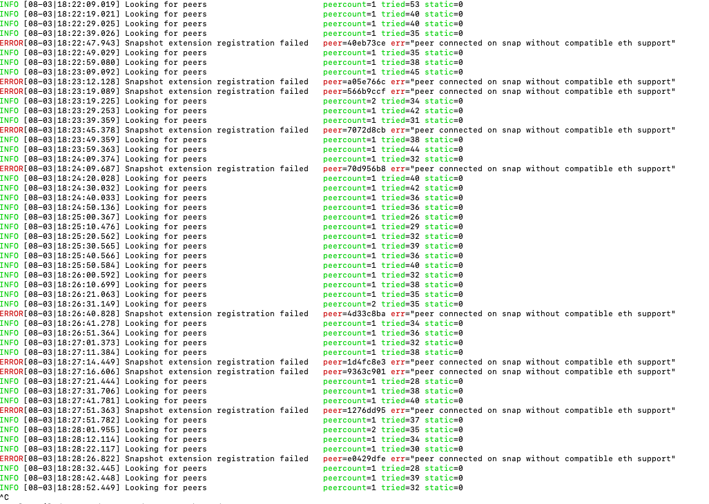
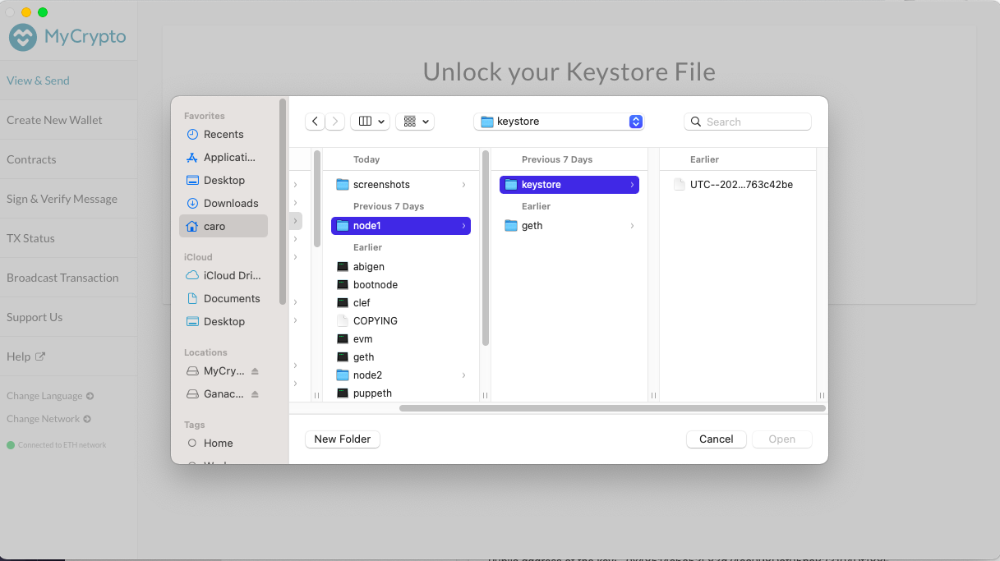
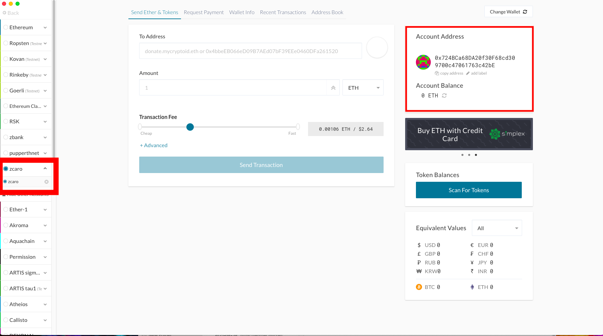

# HW18-Blockchain

## Deploying nodes and configuring them to make a transaction localy using [MyCrypto App](https://mycrypto.com) 

Download the relvant version of [geth]( https://geth.ethereum.org/downloads/)  make sure to ge tthe one with **Tools**

:star: **Make sure to save the "public address key" and "path of secret key file" of your new nodes** :star:

Locate the folder where your geth is using your terminal and do as follows:

Run the following comand in terminal to set up nodes 

```
./geth account new --datadir node1
./geth account new --datadir node2

```

Then type ``` ./puppeth ``` and name your network

Then set up your new genesis and choose the "Clique- proof-of-authority option"

For the accounts that are allowed to sealed you need to include your nodes public address key

:bangbang: **Remember your chain/network ID when doing the set up since you will need it to create a custom network in MyCrypto**:bangbang:

---


---



---

Then run the following command to initialize your node 

```
./geth init <NAME OF YOUR NETWORK>.json --datadir node1
./geth init <NAME OF YOUR NETWORK>.json --datadir node2

```



Then in different terminal windows run the following to connect the nodes and begging mining 

NODE 1 
```
./geth --datadir node1 --unlock "<YOUR NODE ONE ADDRESS>" --mine --rpc --allow-insecure-unlock

```
:bangbang: **TAKE NOTE OF YOUR ENODE ADDRESS ONCE YOU RAN THE COMMAND (YOU WILL NEED IT FOR NODE 2)** :bangbang:

NODE 2 
```
./geth --datadir node2 --unlock "<YOUR NODE TWO ADDRESS>" --mine --port 30304 --bootnodes "<<ENODE FROM NODE ONE>>" --ipcdisable --allow-insecure-unlock

```
---
:anger: Note:
I was not able to mine since I consistenly got the following error (see images below)
At the begging I thought it was because my ganache was running but it did not work even after quiting it, restarting my computer or redoing everything multiple times.
 :broken_heart: :broken_heart: :broken_heart: :broken_heart: :broken_heart: :broken_heart: :broken_heart: :broken_heart:
---


---



---

To make a transaction between your nodes you can deploy MyCrypto and open a wallet using the keystore file for node one (found in your folder where you store your geth files)

---


---

### Since I was not able to mine with my nodes I could not get a balance in my wallet to make a transaction but if you have manage to make it work, all you have to do is input your node 2 address and choose an amount to send, just make sure you are connected to your custom network which you created with the same Chain/network ID as the set up (The one you saved while doing the set up :wink: )

---


---
